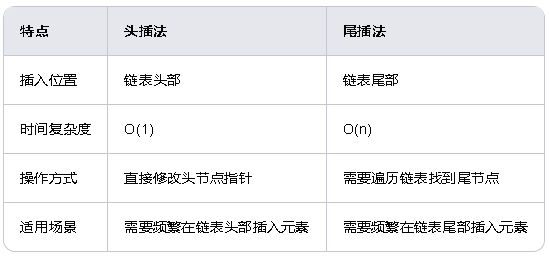

[toc]
# 基础数据结构
## 数组
### 1. 静态数组

在Java中，静态数组的大小在声明时确定，且不能改变。

```java
public class StaticArrayExample {
    public static void main(String[] args) {
        int[] arr = new int[10]; // 定义一个大小为10的静态数组
        for (int i = 0; i < arr.length; i++) {
            arr[i] = i + 1; // 填充数组
        }
        for (int i : arr) {
            System.out.print(i + " "); // 打印数组元素
        }
    }
}
```

### 2. 动态数组

在Java中，可以使用`ArrayList`来实现动态数组，其大小可以在运行时动态调整。

```java
import java.util.ArrayList;

public class DynamicArrayExample {
    public static void main(String[] args) {
        ArrayList<Integer> list = new ArrayList<>(); // 定义一个动态数组
        for (int i = 0; i < 10; i++) {
            list.add(i + 1); // 添加元素
        }
        for (int i : list) {
            System.out.print(i + " "); // 打印数组元素
        }
    }
}
```

### 3. 一维数组

一维数组是最基本的数组形式，存储的是一系列线性排列的数据元素。

```java
public class OneDimensionalArrayExample {
    public static void main(String[] args) {
        int[] arr = {1, 2, 3, 4, 5}; // 定义一个一维数组
        for (int i : arr) {
            System.out.print(i + " "); // 打印数组元素
        }
    }
}
```

### 4. 多维数组

多维数组是由多个一维数组组成的数组，常见的有二维数组和三维数组。

```java
public class MultiDimensionalArrayExample {
    public static void main(String[] args) {
        int[][] arr = {
            {1, 2, 3},
            {4, 5, 6},
            {7, 8, 9}
        }; // 定义一个二维数组
        for (int[] row : arr) {
            for (int i : row) {
                System.out.print(i + " "); // 打印数组元素
            }
            System.out.println();
        }
    }
}
```

### 5. 稀疏数组

稀疏数组是一种特殊的数组，其中大部分元素是零或默认值。为了节省内存，稀疏数组通常只存储非零元素及其位置信息。

```java
import java.util.HashMap;

public class SparseArrayExample {
    public static void main(String[] args) {
        int[][] sparseMatrix = {
            {0, 0, 0, 0, 0},
            {0, 5, 0, 0, 0},
            {0, 0, 0, 0, 0},
            {0, 0, 0, 8, 0},
            {0, 0, 0, 0, 0}
        }; // 定义一个稀疏矩阵
        HashMap<String, Integer> sparseArray = new HashMap<>();
        for (int i = 0; i < sparseMatrix.length; i++) {
            for (int j = 0; j < sparseMatrix[i].length; j++) {
                if (sparseMatrix[i][j] != 0) {
                    sparseArray.put(i + "," + j, sparseMatrix[i][j]); // 存储非零元素及其位置信息
                }
            }
        }
        for (String key : sparseArray.keySet()) {
            System.out.println(key + ": " + sparseArray.get(key)); // 打印稀疏数组
        }
    }
}
```

### 6. 关联数组

关联数组是一种特殊的数组，其中的元素通过键值对存储，键是唯一的，值可以是任意类型的数据。

```java
import java.util.HashMap;

public class AssociativeArrayExample {
    public static void main(String[] args) {
        HashMap<String, Integer> dict = new HashMap<>(); // 定义一个关联数组
        dict.put("a", 1);
        dict.put("b", 2);
        dict.put("c", 3);
        for (String key : dict.keySet()) {
            System.out.println(key + ": " + dict.get(key)); // 打印关联数组
        }
    }
}
```
### 总结

* **静态数组** 适用于大小固定且已知的场景
* **动态数组** 适用于大小不确定或需要动态调整的场景
* **一维数组** 适用于线性存储和访问数据的场景
* **多维数组** 适用于存储多维数据的场景。
* **稀疏数组** 适用于大部分元素为零或默认值的场景，
* **关联数组** 适用于需要通过键快速访问数据的场景

## 链表
链表是一种常见的数据结构，它由一系列节点组成，每个节点包含数据部分和指向下一个节点的指针。链表的实现方式、特点和使用场景如下：

### 链表的实现

#### 单链表

单链表是最基本的链表形式，每个节点只有一个指向下一个节点的指针。

```java
class Node {
    int data;
    Node next;

    public Node(int data) {
        this.data = data;
        this.next = null;
    }
}

class LinkedList {
    Node head;

    public LinkedList() {
        this.head = null;
    }

    // 添加节点到链表末尾
    public void append(int data) {
        Node newNode = new Node(data);
        if (head == null) {
            head = newNode;
            return;
        }
        Node current = head;
        while (current.next != null) {
            current = current.next;
        }
        current.next = newNode;
    }

    // 打印链表
    public void printList() {
        Node current = head;
        while (current != null) {
            System.out.print(current.data + " ");
            current = current.next;
        }
        System.out.println();
    }
}

public class LinkedListExample {
    public static void main(String[] args) {
        LinkedList list = new LinkedList();
        list.append(1);
        list.append(2);
        list.append(3);
        list.printList(); // 输出: 1 2 3
    }
}
```

#### 双链表

双链表的每个节点有两个指针，分别指向前一个节点和后一个节点。

```java
class DoublyNode {
    int data;
    DoublyNode prev;
    DoublyNode next;

    public DoublyNode(int data) {
        this.data = data;
        this.prev = null;
        this.next = null;
    }
}

class DoublyLinkedList {
    DoublyNode head;

    public DoublyLinkedList() {
        this.head = null;
    }

    // 添加节点到链表末尾
    public void append(int data) {
        DoublyNode newNode = new DoublyNode(data);
        if (head == null) {
            head = newNode;
            return;
        }
        DoublyNode current = head;
        while (current.next != null) {
            current = current.next;
        }
        current.next = newNode;
        newNode.prev = current;
    }

    // 打印链表
    public void printList() {
        DoublyNode current = head;
        while (current != null) {
            System.out.print(current.data + " ");
            current = current.next;
        }
        System.out.println();
    }
}

public class DoublyLinkedListExample {
    public static void main(String[] args) {
        DoublyLinkedList list = new DoublyLinkedList();
        list.append(1);
        list.append(2);
        list.append(3);
        list.printList(); // 输出: 1 2 3
    }
}
```

### 链表的特点

* **动态大小**：链表的大小可以在运行时动态调整，不需要预先分配内存。
* **插入和删除操作灵活**：在链表中插入和删除节点只需要修改指针，不需要移动其他节点，时间复杂度为O(1)。
* **内存使用灵活**：链表的节点可以分散在内存中，不需要连续的内存空间。
* **访问速度较慢**：链表的访问需要从头节点开始逐个遍历，时间复杂度为O(n)。

### 链表的使用场景

* **需要频繁插入和删除元素的场景**：如内存管理、文件系统、任务调度等。
* **数据大小不确定的场景**：如动态数据集合、链表队列等。
* **需要灵活内存管理的场景**：如稀疏矩阵存储、图的邻接表表示等。

### 总结

链表是一种灵活的数据结构，适用于需要`动态调整大小`和`频繁插入删除元素`的场景。
* 单链表和双链表是两种常见的链表形式，单链表结构简单，双链表操作灵活。

**头插法**和**尾插法**是链表中常见的两种插入方法，它们在插入节点的位置和操作方式上有所不同。以下是头插法和尾插法的区别以及它们的使用场景：
### 头插法
* 定义
头插法是指将新节点插入到链表的头部，即新节点成为链表的第一个节点。
* 实现
```java
class Node {
    int data;
    Node next;

    public Node(int data) {
        this.data = data;
        this.next = null;
    }
}

class LinkedList {
    Node head;

    public LinkedList() {
        this.head = null;
    }

    // 头插法插入节点
    public void insertAtHead(int data) {
        Node newNode = new Node(data);
        newNode.next = head; // 新节点的下一个节点指向当前头节点
        head = newNode; // 更新头节点为新节点
    }

    // 打印链表
    public void printList() {
        Node current = head;
        while (current != null) {
            System.out.print(current.data + " ");
            current = current.next;
        }
        System.out.println();
    }
}

public class HeadInsertExample {
    public static void main(String[] args) {
        LinkedList list = new LinkedList();
        list.insertAtHead(3);
        list.insertAtHead(2);
        list.insertAtHead(1);
        list.printList(); // 输出: 1 2 3
    }
}
```
### 尾插法
定义
尾插法是指将新节点插入到链表的尾部，即新节点成为链表的最后一个节点。
实现
```java
class Node {
    int data;
    Node next;

    public Node(int data) {
        this.data = data;
        this.next = null;
    }
}

class LinkedList {
    Node head;

    public LinkedList() {
        this.head = null;
    }

    // 尾插法插入节点
    public void insertAtTail(int data) {
        Node newNode = new Node(data);
        if (head == null) {
            head = newNode; // 如果链表为空，新节点成为头节点
            return;
        }
        Node current = head;
        while (current.next != null) {
            current = current.next; // 找到链表的最后一个节点
        }
        current.next = newNode; // 将新节点插入到链表尾部
    }

    // 打印链表
    public void printList() {
        Node current = head;
        while (current != null) {
            System.out.print(current.data + " ");
            current = current.next;
        }
        System.out.println();
    }
}

public class TailInsertExample {
    public static void main(String[] args) {
        LinkedList list = new LinkedList();
        list.insertAtTail(1);
        list.insertAtTail(2);
        list.insertAtTail(3);
        list.printList(); // 输出: 1 2 3
    }
}
```
### 头插法与尾插法的区别
* **特点**

* **使用场景**
**头插法**：
适用场景：适用于需要频繁在链表头部插入元素的场景，如实现栈（后进先出）。
优点：插入操作简单，时间复杂度为O(1)。
缺点：链表的顺序与插入顺序相反，需要额外处理。
**尾插法**：
适用场景：适用于需要频繁在链表尾部插入元素的场景，如实现队列（先进先出）。
优点：链表的顺序与插入顺序一致，便于遍历和处理。
缺点：需要遍历链表找到尾节点，时间复杂度为O(n)。
### 总结
头插法和尾插法是链表中常见的两种插入方法，选择哪种方法取决于具体的应用需求。头插法适用于需要频繁在链表头部插入元素的场景，操作简单且时间复杂度低；尾插法适用于需要频繁在链表尾部插入元素的场景，链表顺序与插入顺序一致，便于遍历和处理。
### java中链表的实现
在Java中，标准的`LinkedList`类并没有明确指定使用头插法还是尾插法，因为它提供了多种方法来操作链表，包括在头部、尾部以及指定位置插入元素。不过，从实现的角度来看，`LinkedList`类内部使用了双向链表来存储元素，这使得在头部和尾部插入元素都非常高效。

### Java `LinkedList` 的实现方式

Java的`LinkedList`类是一个双向链表的实现，它在内部维护了两个引用：`first`和`last`，分别指向链表的第一个节点和最后一个节点。这种设计使得在链表的头部和尾部插入元素都非常高效，时间复杂度为O(1)。

#### 主要方法

* **在头部插入元素**：`addFirst(E e)` 或 `offerFirst(E e)`
* **在尾部插入元素**：`addLast(E e)` 或 `offerLast(E e)` 或 `add(E e)` 或 `offer(E e)`
* **在指定位置插入元素**：`add(int index, E element)`

### 示例代码

以下是一个使用Java `LinkedList`的示例，展示如何在头部和尾部插入元素：
```java
import java.util.LinkedList;

public class LinkedListExample {
    public static void main(String[] args) {
        LinkedList<Integer> list = new LinkedList<>();

        // 在尾部插入元素
        list.add(1);
        list.add(2);
        list.add(3);
        System.out.println("After adding elements to tail: " + list);

        // 在头部插入元素
        list.addFirst(0);
        System.out.println("After adding element to head: " + list);

        // 在指定位置插入元素
        list.add(2, 99);
        System.out.println("After adding element at index 2: " + list);
    }
}
```

### 输出结果
```
After adding elements to tail: [1, 2, 3]
After adding element to head: [0, 1, 2, 3]
After adding element at index 2: [0, 1, 99, 2, 3]
```

### 内部实现

Java的`LinkedList`类内部使用了双向链表的结构，每个节点包含三个部分：数据、前驱指针和后继指针。这种结构使得在头部和尾部插入元素都非常高效，因为可以直接通过`first`和`last`引用进行操作，而不需要遍历整个链表。

#### 节点类

```java
private static class Node<E> {
    E item;
    Node<E> next;
    Node<E> prev;

    Node(Node<E> prev, E element, Node<E> next) {
        this.item = element;
        this.next = next;
        this.prev = prev;
    }
}
```

#### 插入方法

* **在头部插入元素**：
```java
  public void addFirst(E e) {
      linkFirst(e);
  }

  private void linkFirst(E e) {
      final Node<E> f = first;
      final Node<E> newNode = new Node<>(null, e, f);
      first = newNode;
      if (f == null)
          last = newNode;
      else
          f.prev = newNode;
      size++;
      modCount++;
  }
```

* **在尾部插入元素**：
```java
  public void addLast(E e) {
      linkLast(e);
  }

  private void linkLast(E e) {
      final Node<E> l = last;
      final Node<E> newNode = new Node<>(l, e, null);
      last = newNode;
      if (l == null)
          first = newNode;
      else
          l.next = newNode;
      size++;
      modCount++;
  }
```

### 总结

Java的`LinkedList`类使用了双向链表的结构，支持在头部和尾部高效地插入元素。虽然它没有明确指定使用头插法还是尾插法，但它的设计使得在头部和尾部插入元素都非常高效，时间复杂度为O(1)。这种灵活性使得`LinkedList`适用于多种需要动态插入和删除元素的场景。

## 队列
## 栈