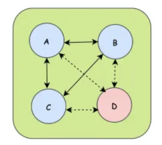
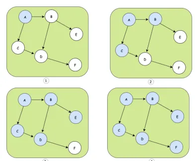
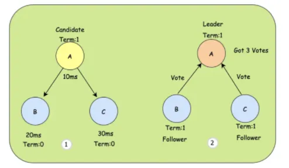
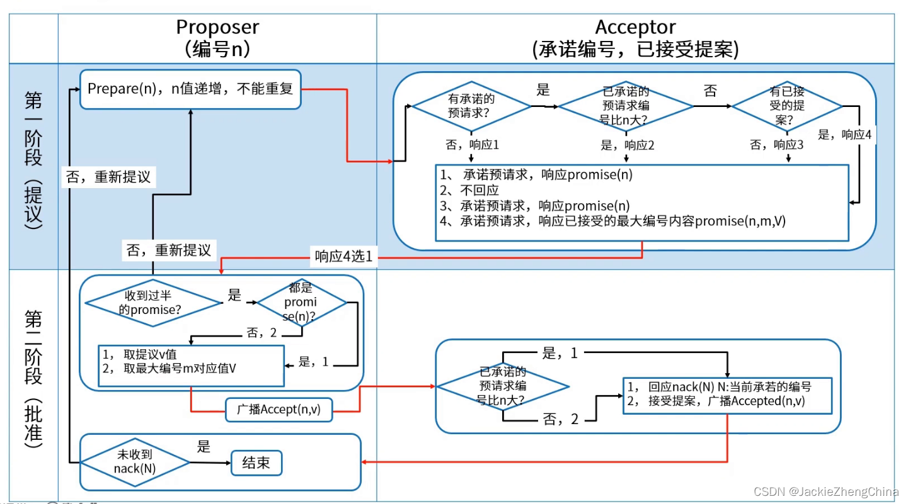

# 分布式数据一致性算法

## 一、Gossip协议

集群往往是由多个节点共同组成的，当一个节点加入集群或者一个节点从集群中下线的时候，都需要让集群中其他的节点知道，这样才能将数据信息分享给新节点而忽略下线节点。

如上图，A、B、C 节点之间可以互相传递消息，但是D节点在下线之后会被广播告诉其他存活节点。这样的广播协议就是今天要说Gossip协议，Gossip协议也叫Epidemic协议（流行病协议），当一个消息到来时，通过Gossip协议就可以像病毒一样感染全部集群节点。Gossip的过程是由一个种子节点发起的，当一个种子节点有信息需要同步到网络中的其他节点时，它会随机的选择周围几个节点散播消息，收到消息的节点也会重复该过程，直至最终网络中所有的节点都收到了消息。这个过程可能需要一定的时间，所以不能保证某个时间点所有的节点都有该条消息，但是理论上最终所有节点都会收到消息，因此它是一个最终一致性协议。

Gossip协议的特点：

- （1）Gossip协议是周期性散播消息，每隔一段时间传播一次
- （2）被感染的节点，每次可以继续散播N个节点
- （3）每次散播消息时，都会选择尚未发送过的节点进行散播，不会向发送的节点散播
- （4）同一个节点可能会收到重复的消息，因为可能同时多个节点正好向它散播
- （5）集群是去中心化的，节点之间都是平等的
- （6）消息的散播不用等接收节点的 ack，即消息可能会丢失，但是最终应该会被感染

- ① 种子节点是A
- ② A节点选择B、C节点进行散播
- ③ C散播到D，B散播D和E，可以发现D收到两次
- ④ D散播到F，最终整个网络都同步到了消息

Gossip有点类似图的广度优先遍历算法，一般用于网络拓扑结构信息的分享和维护，比如 Redis 集群中节点的运行状态就是使用 Gossip 协议进行传递的

## 二、Raft一致性协议

分布式协议的难点之一就是数据的一致性，当由多个节点组成的集群中只有一个节点收到数据，我们就算成功的话，风险太大，当要求所有节点都收到数据才响应成功，性能又太差，所以一般会在数据的安全和性能之间做个折中，只要保证绝大部分节点同步数据成功，我们就算成功。比较知名的一致性算法有Raft算法，被广泛应用于许多中间件中，接下来我们就看看Raft算法是实现分布式系统的不同节点间的数据一致性的，也就是说客户端发送请求到任何一个节点都能收到一致的返回，当一个节点出故障后，其他节点仍然能以已有的数据正常进行。

首先介绍下在Raft算法中，几种情况下每个节点对应的角色：

（1）Leader节点：同大多数分布式中的Leader节点一样，所有数据的变更都需要先经过Leader

（2）Follower节点：Leader节点的追随者，负责复制数据并且在选举时候投票的节点

（3）Candidate候选节点：参与选举的节点，就是Follower节点参与选举时会切换的角色

Raft算法将一致性问题分解为两个的子问题，Leader选举 + 数据日志的复制：

- ① 由于A节点的定时器时间最短（10ms），所以A会成为Candidate。
- ② A投自己一票，并告诉B、C来投票，B、C也投出自己的同意票后，A就会变成Leader节点，同时会记录是第M任。这个M是做版本校验的，比如一个编号是10的节点，收到了一个编号是9的节点的投票请求，那么就会拒绝这个请求。

在Leader节点选举出来以后，Leader节点会不断的发送心跳给其它Follower节点证明自己是活着的，其他Follower节点在收到心跳后会清空自己的定时器，并回复给Leader，因为此时没必要触发选举了。

如果Leader节点在某一刻挂了，那么Follower节点就不会收到心跳，因此在定时器到来时就会触发新一轮的选举，流程还是一样。但是如果恰巧两个Follower都变成了Candidate，并且都得到了同样的票数，那么此时就会陷入僵局，为了打破僵局，这时每个Candidate都会随机推迟一段时间再次请求投票，当然一般情况下，就是先来先得，优先跑完定时器的Candidate理论成为Leader的概率更大。

当Leader节点收到客户端Client的请求变更时，会把变更记录到log中，然后Leader会将这个变更随着下一次的心跳通知给Follower节点，收到消息的Follower节点把变更同样写入日志中，然后回复Leader节点，当Leader收到大多数的回复后，就把变更写入自己的存储空间，同时回复client，并告诉Follower应用此log。至此，集群就变更达成了共识。

## 三、Paxos 算法

Paxos算法解决的问题正是分布式一致性问题，即一个分布式系统中的各个进程如何就某个值（决议）达成一致。

Paxos算法运行在允许宕机故障的异步系统中，不要求可靠的消息传递，可容忍消息丢失、延迟、乱序以及重复。它利用大多数 (Majority) 机制保证了2F+1的容错能力，即2F+1个节点的系统最多允许F个节点同时出现故障。

一个或多个提议进程 (Proposer) 可以发起提案 (Proposal)，Paxos算法使所有提案中的某一个提案，在所有进程中达成一致。系统中的多数派同时认可该提案，即达成了一致。最多只针对一个确定的提案达成一致。

Paxos将系统中的角色分为提议者 (Proposer)，决策者 (Acceptor)，和最终决策学习者 (Learner):

- Proposer: 提出提案 (Proposal)。Proposal信息包括提案编号 (Proposal ID) 和提议的值 (Value)。
- Acceptor：参与决策，回应Proposers的提案。收到Proposal后可以接受提案，若Proposal获得多数Acceptors的接受，则称该Proposal被批准。
- Learner：不参与决策，从Proposers/Acceptors学习最新达成一致的提案（Value）。

在多副本状态机中，每个副本同时具有Proposer、Acceptor、Learner三种角色。

Paxos算法通过一个决议分为两个阶段（Learn阶段之前决议已经形成）：

1. 第一阶段：Prepare阶段。Proposer向Acceptors发出Prepare请求，Acceptors针对收到的Prepare请求进行Promise承诺。
2. 第二阶段：Accept阶段。Proposer收到多数Acceptors承诺的Promise后，向Acceptors发出Propose请求，Acceptors针对收到的Propose请求进行Accept处理。
3. 第三阶段：Learn阶段。Proposer在收到多数Acceptors的Accept之后，标志着本次Accept成功，决议形成，将形成的决议发送给所有Learners。

Paxos算法流程

Paxos算法流程中的每条消息描述如下：

- Prepare: Proposer生成全局唯一且递增的Proposal ID (可使用时间戳加Server ID)，向所有Acceptors发送Prepare请求，这里无需携带提案内容，只携带Proposal ID即可。
- Promise: Acceptors收到Prepare请求后，做出“两个承诺，一个应答”。

两个承诺：

1. 不再接受Proposal ID小于等于（注意：这里是<= ）当前请求的Prepare请求。

2. 不再接受Proposal ID小于（注意：这里是< ）当前请求的Propose请求。

一个应答：

不违背以前作出的承诺下，回复已经Accept过的提案中Proposal ID最大的那个提案的Value和Proposal ID，没有则返回空值。

- Propose: Proposer 收到多数Acceptors的Promise应答后，从应答中选择Proposal ID最大的提案的Value，作为本次要发起的提案。如果所有应答的提案Value均为空值，则可以自己随意决定提案Value。然后携带当前Proposal ID，向所有Acceptors发送Propose请求。
- Accept: Acceptor收到Propose请求后，在不违背自己之前作出的承诺下，接受并持久化当前Proposal ID和提案Value。
- Learn: Proposer收到多数Acceptors的Accept后，决议形成，将形成的决议发送给所有Learners。