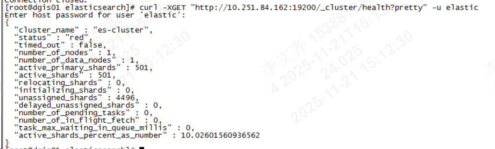
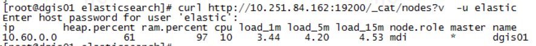
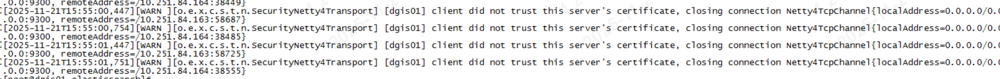
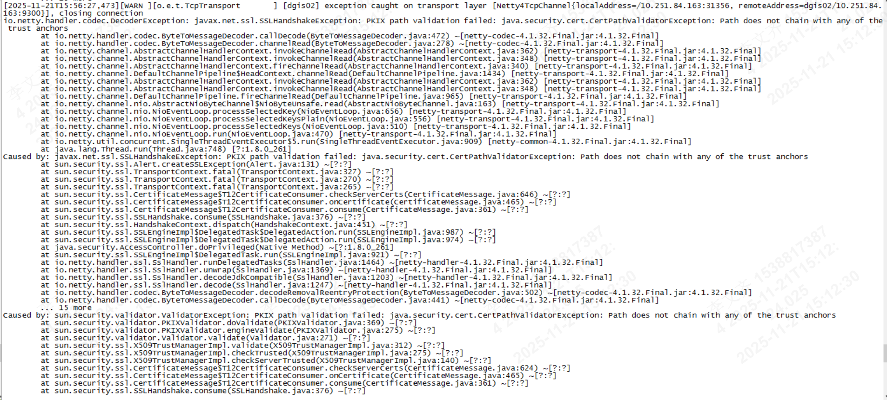
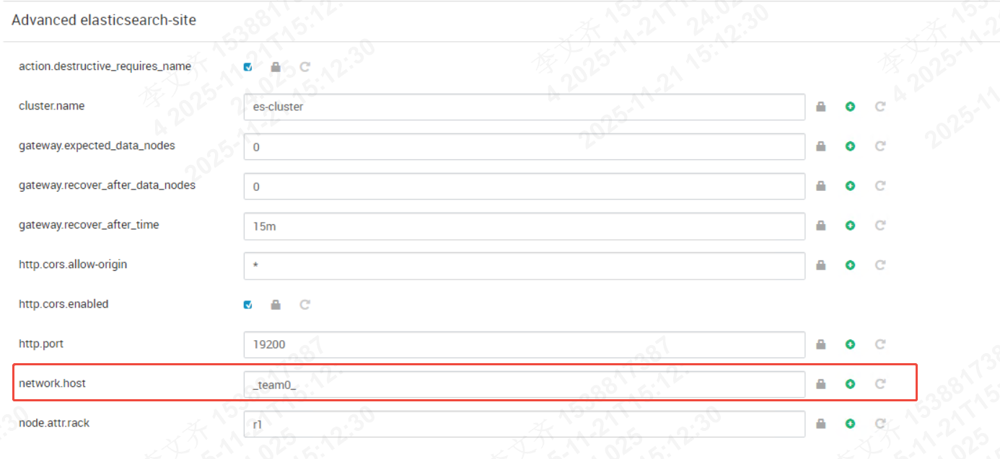
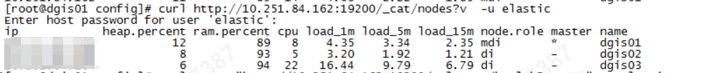
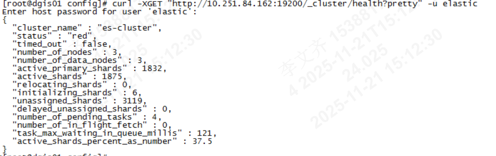

# 1、集群节点问题修复
~~~sh
curl http://xxxx: 9200/_cat/nodes?v  -u elastic

curl -XGET "http://10.251.84.162:19200/_cluster/health?pretty" -u elastic
~~~

master错误信息

data 节点报错

上面都体现出证书的问题。

解决方法； 修改 network.host  为 生成证书时配置的ip 的网卡。否则IP绑定错误也会导致证书认证失败。

完成修改后依次重启即可。ip 为指导的ip即可。

# 2、集群状态修复

~~~sh
curl -XGET "http://10.251.84.162:19200/_cat/shards?v&h=index,shard,prirep,state,unassigned.reason" -u elastic | grep UNASSIGNED
~~~

当前集群正在自动恢复完成恢复后，将master节点不在写入数据

