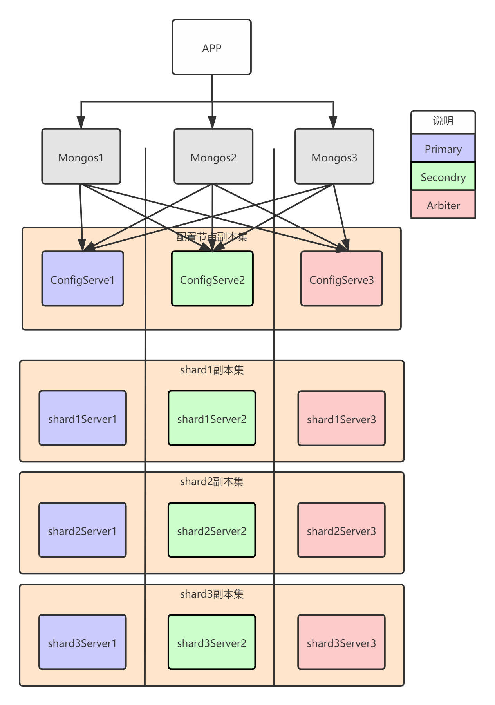
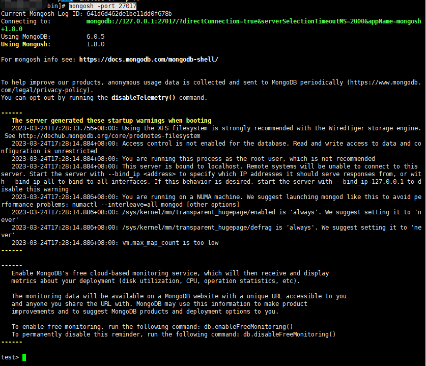
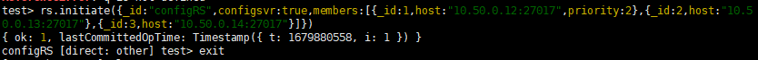
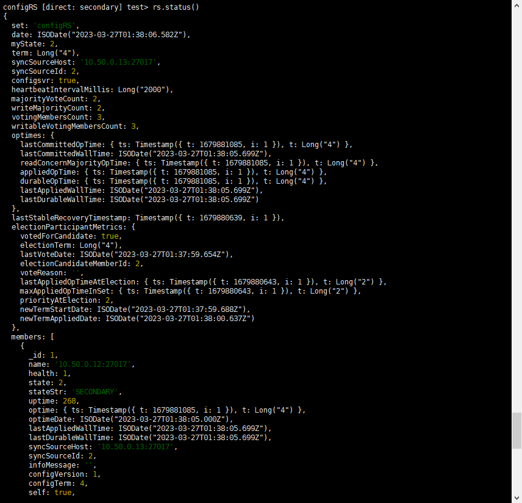
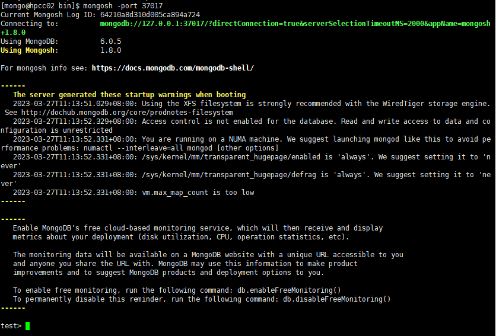
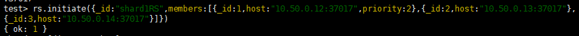
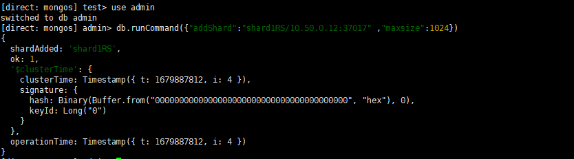

[toc]

# MongoDB Sharding集群搭建

参考：https://blog.51cto.com/silentwolfyh/5975066

## 一、 集群的三个组件：

mongos(query routers):查询路由，负责client的连接，并把任务分配给shards，然后收集结果。
config server:配置服务器，保存了集群的元数据信息，查询路由通过配置服务器的配置信息决定把任务分配+到哪个shards上。
shards server:分片，存储数据和执行计算。

## 二、 集群架构图：

## 三、 集群的IP及端口规划：

| 服务   | 10.50.0.12(hpcc02)    | 10.50.0.13(hpcc03)    | 10.50.0.14(hpcc04)    |
| ------ | --------------------- | --------------------- | --------------------- |
| router | Mongos(17017)         | Mongos(17017)         |                       |
| config | Config server1(27017) | Config server2(27017) | Config server3(27017) |
|        | Shard1-主(37017)      | Shard2-主(47017)      | Shard3-主(57017)      |
| shard  | Shard2-从(47017)      | Shard1-从(37017)      | Shard1-从(37017)      |
|        | Shard3-从(57017)      | Shard3-从(57017)      | Shard2-从(47017)      |

## 四、 集群在LINUX上的目录规划

## 五、开始搭建集群

1. 下载软件

软件包：

2. 创建目录

~~~shell
useradd mongo
su - mongo
mkdir -p /home/mongo/config/logs
mkdir -p /home/mongo/router/logs
mkdir -p /home/mongo/shard/logs
~~~

3. 解压安装包，并分别复制到config、router、shard三个目录下

~~~shell
cp -r mongodb-linux-x86_64-rhel70-6.0.5/* config/
cp -r mongodb-linux-x86_64-rhel70-6.0.5/* router/
cp -r mongodb-linux-x86_64-rhel70-6.0.5/* shard/
~~~

4. 将数据文件夹挂到硬盘目录

~~~shell
mkdir -p /data3/mongo/config/data
mkdir -p /data3/mongo/shard/data
mkdir -p /data3/mongo/shard/data/{shard1,shard2,shard3}

ln -s /data3/mongo/config/data /home/mongo/config
ln -s /data3/mongo/shard/data /home/mongo/shard

chown -R mongo:mongo /data3/mongo
chown -R mongo:mongo /home/mongo
su - mongo
~~~

5. 安装db-tools、db-shell

   ~~~shel
   # db-tools 解压文件即可
   tar -zxvf mongodb-database-tools-rhel70-x86_64-100.7.0.tgz
   
   # db-shell 为 rpm包
   rpm -Uvh mongodb-mongosh-1.8.0.x86_64.rpm
   ~~~

   

6. 配置config server

* 新建config实例启动所需的配置文件，并启动实例。

  ~~~shel
  # 注意修改 bind_ip 为主机ip
  
  echo "
  dbpath=/home/mongo/config/data
  logpath=/home/mongo/config/logs/mongo.log
  bind_ip=10.50.0.12,127.0.0.1
  port=27017
  logappend=true
  fork=true
  quiet=true
  journal=true
  configsvr=true
  replSet=configRS/hpcc02:27017,hpcc03:27017,hpcc04:27017
  "  > /home/mongo/config/mongo.config
  
  cd /home/mongo/config/bin/
  # 实际--bind_ip参数使用部署的ip
  ./mongod -f /home/mongo/config/mongo.config
  ~~~

* 初始化config server.

  ~~~shell
  mongosh -port 27017
  ~~~

~~~json
rs.initiate({_id:"configRS",configsvr:true,members:[{_id:1,host:"10.50.0.12:27017",priority:2},{_id:2,host:"10.50.0.13:27017"},{_id:3,host:"10.50.0.14:27017"}]})
~~~

**可以使用** `rs.status()` **查看状态**

7. 启动 mongos 路由服务器

   ~~~ sh
   echo "
   logpath=/home/mongo/router/logs/mongo.log
   bind_ip_all=1
   port=17017
   logappend=true
   fork=true
   configdb=configRS/hpcc02:27017,hpcc03:27017,hpcc04:27017
   "  > /home/mongo/router/mongo.config
   
   cd /home/mongo/router/bin
   
   ./mongos -f /home/mongo/router/mongo.config
   ~~~

8. 配置分片服务器

   ~~~sh
   # 注意修改 bind_ip 为主机ip
   
   echo "
   dbpath=/home/mongo/shard/data/shard1
   logpath=/home/mongo/shard/logs/shard1.log
   bind_ip=127.0.0.1,10.50.0.14
   port=37017
   logappend=true
   fork=true
   quiet=true
   journal=true
   shardsvr=true
   replSet= shard1RS/10.50.0.12:37017,10.50.0.13:37017,10.50.0.14:37017
   " >  /home/mongo/shard/shard1.config
   
   
   echo "
   dbpath=/home/mongo/shard/data/shard2
   logpath=/home/mongo/shard/logs/shard2.log
   bind_ip=127.0.0.1,10.50.0.14
   port=47017
   logappend=true
   fork=true
   quiet=true
   journal=true
   shardsvr=true
   replSet= shard2RS/10.50.0.12:47017,10.50.0.13:47017,10.50.0.14:47017
   " >  /home/mongo/shard/shard2.config
   
   echo "
   dbpath=/home/mongo/shard/data/shard3
   logpath=/home/mongo/shard/logs/shard3.log
   bind_ip=127.0.0.1,10.50.0.14
   port=57017
   logappend=true
   fork=true
   quiet=true
   journal=true
   shardsvr=true
   replSet= shard3RS/10.50.0.12:57017,10.50.0.13:57017,10.50.0.14:57017
   " >  /home/mongo/shard/shard3.config
   
   cd /home/mongo/shard/bin 
   
   ./mongod -f /home/mongo/shard/shard1.config
   ./mongod -f /home/mongo/shard/shard2.config
   ./mongod -f /home/mongo/shard/shard3.config
   ~~~

   初始化分片服务

   ~~~ sh
   mongosh -port 37017
   ~~~

   

   

   ~~~json
   -- 注意修改 _id 为shardx.config中的分片名称,设置了priority属性的为主节点，根据规划修改
   rs.initiate({_id:"shard1RS",members:[{_id:1,host:"10.50.0.12:37017",priority:2},{_id:2,host:"10.50.0.13:37017"},{_id:3,host:"10.50.0.14:37017"}]})
   ~~~

   

   ~~~json
   -- 注意修改 _id 为shardx.config中的分片名称,设置了priority属性的为主节点，根据规划修改
   rs.initiate({_id:"shard2RS",members:[{_id:1,host:"10.50.0.13:47017",priority:2},{_id:2,host:"10.50.0.12:47017"},{_id:3,host:"10.50.0.14:47017"}]})
   ~~~

   ~~~ json
   -- 注意修改 _id 为shardx.config中的分片名称,设置了priority属性的为主节点，根据规划修改
   rs.initiate({_id:"shard3RS",members:[{_id:1,host:"10.50.0.14:57017",priority:2},{_id:2,host:"10.50.0.13:57017"},{_id:3,host:"10.50.0.12:57017"}]})
   ~~~

9. mongos配置分片

   ~~~sh
   cd /home/mongo/router/bin/
   mongosh -port 17017
   
   use admin
   db.runCommand({"addShard":"shard1RS/10.50.0.12:37017" ,"maxsize":1024})
   db.runCommand({"addShard":"shard2RS/10.50.0.12:47017" ,"maxsize":1024}) 
   db.runCommand({"addShard":"shard3RS/10.50.0.12:57017" ,"maxsize":1024})
   ~~~

   

## 六、常用命令

~~~sh
# 停止服务
/home/mongo/config/bin/mongod --shutdown --dbpath /home/mongo/config/data/
/home/mongo/shard/bin/mongod --shutdown --dbpath /home/mongo/shard/data/

# 常用命令

# 查看分片服务状态
db.runCommand({listshards:1})

# 分片服务状态
rs.status()

# 创建用户，以及初始角色和密码
db.createUser({user:"admin",pwd:"admin_mongodb4322",roles:[{role:'readWrite',db:'test'}]})
# 更新密码
db.changeUserPassword('用户名','新密码')； 

# 插入
db.test.insert({title:"values",url:"vaules"})
~~~

## 七、常见问题以及修复
