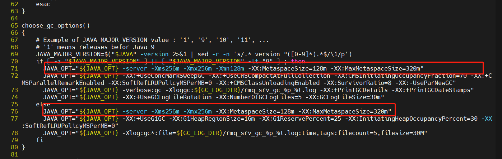
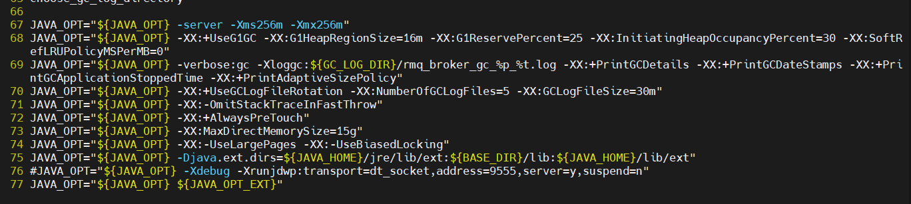
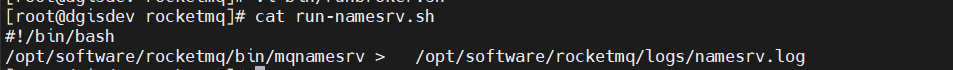

# RocketMQ 安装
## 单机
### 服务器安装
* 参考文档
  [链接](https://blog.csdn.net/laodanqiu/article/details/142622057)
* 下载地址
  [链接](https://archive.apache.org/dist/rocketmq/4.9.2/rocketmq-all-4.9.2-bin-release.zip)
* 创建目录并设置参数
~~~bash
vim /etc/profile
~~~
在文件末尾添加
`export NAMESRV_ADDR={本机可访问ip}:9876`
* 修改默认启动脚本
~~~bash
cd {rocket目录}/bin
vi runserver.sh
~~~

~~~bash
vi runbroker.sh
~~~

* 修改启动配置
~~~bash
cd {rocket目录}/conf
vi broker.conf
~~~
~~~
brokerClusterName = DefaultCluster
brokerName = broker-a
brokerId = 0
deleteWhen = 04
fileReservedTime = 48
brokerRole = ASYNC_MASTER
flushDiskType = ASYNC_FLUSH
namesrvAddr=localhost:9876
autoCreateTopicEnable=true
brokerIP1={本机可访问ip}
~~~
* 自启动配置
创建日志文件目录
~~~bash
mkdir {rocket目录}/logs
~~~
编写自启动脚本
run-namesrv.sh
~~~
#!/bin/bash
/opt/software/rocketmq/bin/mqnamesrv >   /opt/software/rocketmq/logs/namesrv.log
~~~

自启动服务配置
~~~bash
vi /usr/lib/systemd/system/rocket-mq@nanesrv.service
~~~
~~~
[Unit]
Description=RocketMQ nanesrv service
Documentation=https://rocketmq.apache.org/docs/4.x/
[Service]
WorkingDirectory=/opt/software/rocketmq
ExecStart=/opt/software/rocketmq/run-namesrv.sh
Restart=on-failure
RestartSec=5
[Install]
WantedBy=multi-user.target
~~~
~~~bash
chmod 755 run-namesrv.sh
chmod 755 /opt/software/rocketmq/bin/mqnamesrv
chmod -x /usr/lib/systemd/system/rocket-mq@nanesrv.service
~~~
run-broker.sh
~~~
#!/bin/bash
/opt/software/rocketmq/bin/mqbroker -c   /opt/software/rocketmq/conf/broker.conf > /opt/software/rocketmq/logs/broker.log
~~~
~~~bash
vi /usr/lib/systemd/system/rocket-mq@broker.service
~~~
~~~
[Unit]
Description=RocketMQ broker service
Documentation=https://rocketmq.apache.org/docs/4.x/
[Service]
WorkingDirectory=/opt/software/rocketmq
ExecStart=/opt/software/rocketmq/run-broker.sh
Restart=on-failure
RestartSec=5
[Install]
WantedBy=multi-user.target
~~~
~~~bash
chmod 755 run-namesrv.sh
chmod 755 /opt/software/rocketmq/bin/mqbroker
chmod -x /usr/lib/systemd/system/rocket-mq@broker.service
~~~
* 服务启动
~~~bash
systemctl start rocket-mq@nanesrv
systemctl enable rocket-mq@nanesrv
systemctl start rocket-mq@broker
systemctl enable rocket-mq@broker
~~~