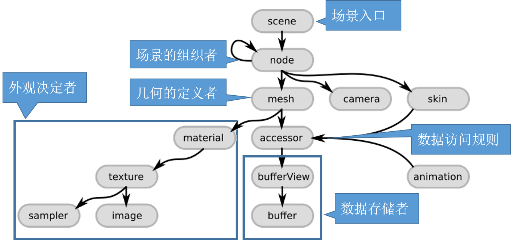
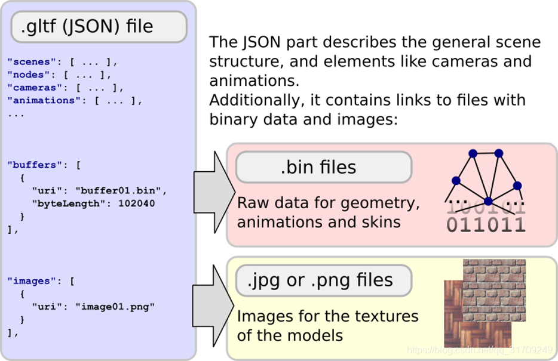

# 常见3d数据格式

## 一、gltf

参考：https://blog.csdn.net/qq_31709249/article/details/86477520

### 1、基础结构

(1)scene：整个场景的入口点，由node构成图（树）结构（类似OSG的场景组织）组成

(2)node：场景层级中的一个节点，可以包含位置变换，可以有子节点。同时，node通过指向mesh、camera、skin来描述node的形变

(3)camera：定义渲染场景的视点配置

(4)mesh：描述了在场景中出现的几何物体，并通过accessor（访问器）来访问其真实的几何数据，通过material（材质）来确定渲染外观

(5)skin：蒙皮描述模型绑定到骨骼上的参数，用来实现骨骼动画，其真实数据也是通过访问器来获取的

(6)animation：骨骼动画，描述某个节点怎么随着时间运动

(7)accessor：访问器，定义了如何从二进制数据源中获取数据，在mesh、animation、skin中都会用到访问器。其指向buffer和bufferview，在这里面存着真正的几何数据

(8)material：材质包含了定义物体模型外观的参数，特别是纹理参数

(9)texture：包括采样器和图片，定义如何将纹理映射到模型

### 2、文件结构

glTF文件主要由以下几个文件组成：

**(1)gltf文件：**json文件，描述整个场景结构、动画、相机以及和二进制文件和图片文件的联系方式

**(2)二进制文件：**几何、动画、蒙皮的真正数据文件

**(3)图片文件：**主要是纹理图片文件

### 3、文件的读取和管理

(1).buffer中的二进制文件

一个buffer包含一个URI，指向包含实际数据的二进制文件（.bin文件），通过buffers、bufferviews和accessors中，可以知道文件的数据类型，布局。读取出来的数据不需要解析，直接送进GPU进行渲染。

(2).图片文件

一个image中包含一个URI，通过这个ID去获取具体的图片文件。

