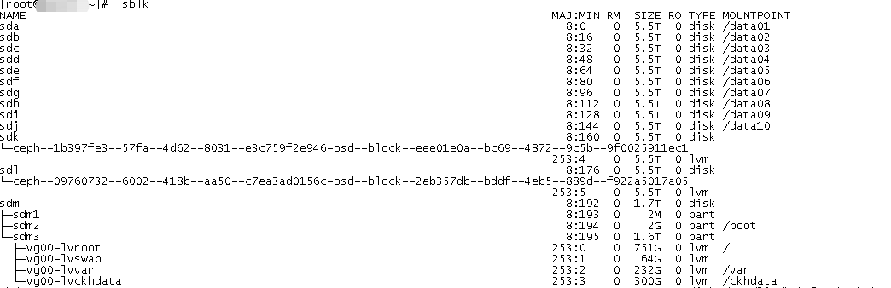
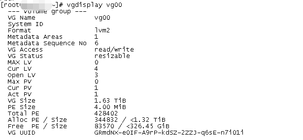
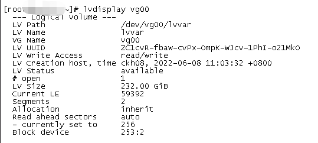

[toc]
## lvm扩容
* 背景
 部署应用运行一段时间后，经常出现docker运行的pod挂掉的问题，在进行部署主机的配置分析后，发现 '/var' 路径的逻辑挂载盘的磁盘大小过低，由此进行的对‘/var’路径的扩容
* 过程
 1.查看整体的挂载情况
~~~shell
lsblk
~~~

2. 根据步骤1中得知 /var -> vg00-lvvar，使用'vgdisplay'查看 vg 使用情况
~~~shell
vgdisplay vg00
~~~

3.根据步骤2中得知，还有空余空间 300G+,查看 /var 实际挂载路径，并分配
~~~shell
# 查看 /var 路径地址
lvdisplay vg00
# 为 /var 增加 100G 磁盘空间
lvextend -L +100G /dev/vg00/lvvar
# 刷新 lv配置
xfs_growfs /dev/vg00/lvvar
~~~
