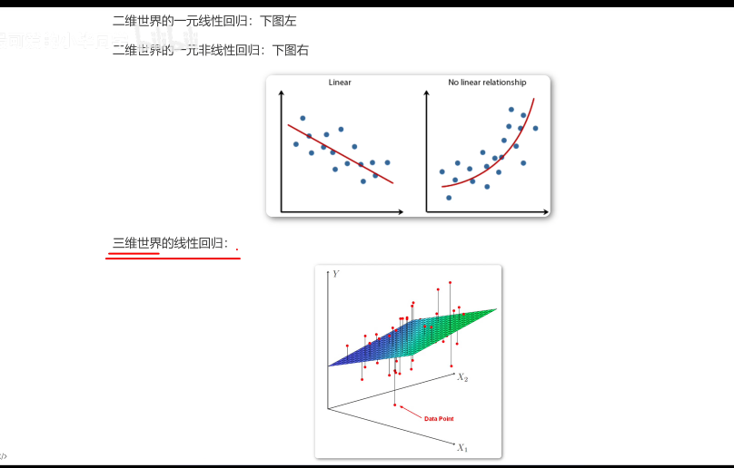
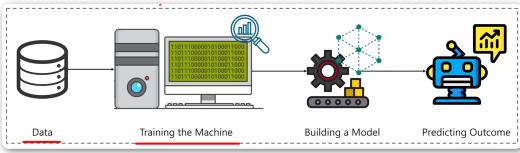
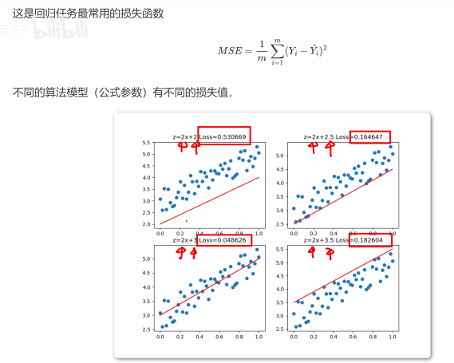
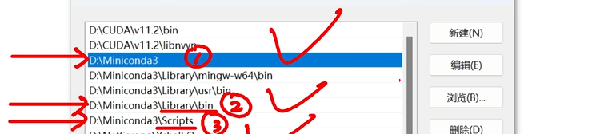
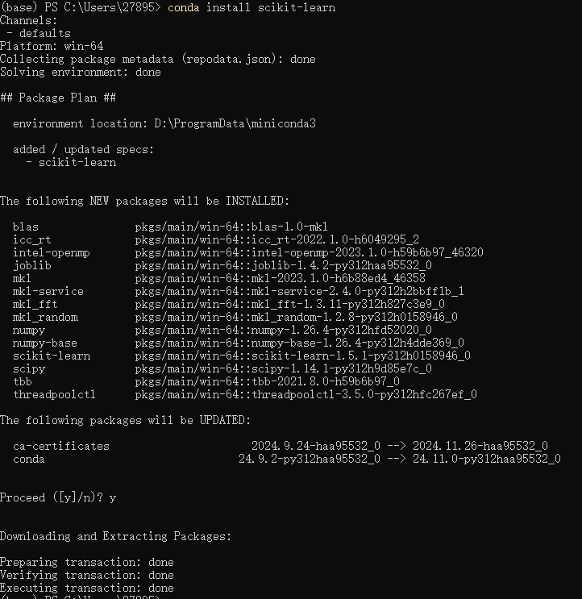

# 多元线性回归算法
根据历史数据训练模型，未来预测具体数值的任务就是回归任务

多个维度

线性： 直线、平面、超平面（hyper plane）

回归：拟合 

在多元世界使用线性体对已有数据进行拟合的方法就是多元线性回归

使用场景，数据与结果成线性变换关系时使用。使用几元由数据决定
执行过程 

损失值最小就是最有参数 

## miniconda 安装
环境变量设置 

 需要当前用户有写入权限

## 第一个项目 糖尿病分析
安装包
~~~powershell
conda install scikit-learn
~~~

交互界面如下 

