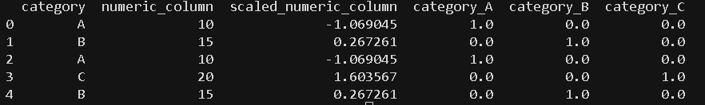

# 数据处理过程

## 一、数据预处理

### 1. 数据清洗

数据清洗是指识别并纠正数据中的错误或不一致之处，以确保数据的准确性和完整性。其目的是解决可能扭曲分析或模型性能的问题。

* **处理缺失值**

  使用均值/众数插补、删除或预测模型等策略来填充或删除缺失数据

* **删除重复项**

  消除重复记录，确保每个条目都是唯一且相关的

* **纠正不一致的格式**

  规范格式（例如，日期格式、字符串大小写），以保持一致性。

~~~python
import pandas as pd
import time
from sklearn.impute import SimpleImputer

startTime = time.time()
print(f"Start time: {startTime}")
# Creating a manual dataset
data = pd.DataFrame({
    'name': ['John', 'Jane', 'Jack', 'John', None],
    'age': [28, 34, None, 28, 22],
    'purchase_amount': [100.5, None, 85.3, 100.5, 50.0],
    'date_of_purchase': ['2023/12/01', '2023/12/02', '2023/12/01', '2023/12/01', '2023/12/03']
	})

# Handling missing values using mean imputation for 'age' and 'purchase_amount'
imputer = SimpleImputer(strategy='mean')
data[['age', 'purchase_amount']] = imputer.fit_transform(data[['age', 'purchase_amount']])

# Removing duplicate rows
data = data.drop_duplicates()

# Correcting inconsistent date formats
data['date_of_purchase'] = pd.to_datetime(data['date_of_purchase'], errors='coerce')

print(data)
endTime = time.time()
print(f"End time: {endTime}")
print(f"Time taken: {endTime - startTime} seconds")
~~~

### 2. 数据集成

数据集成是指将来自多个数据源的数据合并，以创建统一的数据集。当数据来自不同的源系统时，数据集成通常是必要的。

* **模式匹配**

  将来自不同来源的字段和数据结构进行对齐，以确保一致性。

* **数据去重**

  识别并删除多个数据集中的重复条目

~~~python
# Creating two manual datasets
data1 = pd.DataFrame({
    'customer_id': [1, 2, 3],
    'name': ['John', 'Jane', 'Jack'],
    'age': [28, 34, 29]
})

data2 = pd.DataFrame({
    'customer_id': [1, 3, 4],
    'purchase_amount': [100.5, 85.3, 45.0],
    'purchase_date': ['2023-12-01', '2023-12-02', '2023-12-03']
})

# Merging datasets on a common key 'customer_id'
merged_data = pd.merge(data1, data2, on='customer_id', how='inner')

print(merged_data)
~~~

### 3. 数据转换

数据转换将数据转换为适合分析、机器学习或数据挖掘的格式。

* **缩放和归一化**

  对于依赖距离度量的算法来说，将数值调整到共同的尺度通常是必要的。

* **分类变量编码**

  使用独热编码或标签编码技术将分类数据转换为数值

* **特征工程和提取**

  创建新特征或选择重要特征以提高模型性能

~~~python
from sklearn.preprocessing import StandardScaler, OneHotEncoder

# Creating a manual dataset
data = pd.DataFrame({
    'category': ['A', 'B', 'A', 'C', 'B'],
    'numeric_column': [10, 15, 10, 20, 15]
	})

# Scaling numeric data
scaler = StandardScaler()
data['scaled_numeric_column'] = scaler.fit_transform(data[['numeric_column']])

# Encoding categorical variables using one-hot encoding
encoder = OneHotEncoder(sparse_output=False)
encoded_data = pd.DataFrame(encoder.fit_transform(data[['category']]),
                            columns=encoder.get_feature_names_out(['category']))

# Concatenating the encoded data with the original dataset
data = pd.concat([data, encoded_data], axis=1)

print(data)
~~~

### 4. 数据缩减

* **特征选择**

  选择对分析或模型性能贡献最大的特征

* **主成分分析（PCA）**

  一种将数据转换到低维空间的降维技术

* **抽样方法**

  通过选择代表性样本来减少数据集的大小，对于处理大型数据集非常有用

~~~python
from sklearn.decomposition import PCA
from sklearn.feature_selection import SelectKBest, chi2

# Creating a manual dataset
data = pd.DataFrame({
    'feature1': [10, 20, 30, 40, 50],
    'feature2': [1, 2, 3, 4, 5],
    'feature3': [100, 200, 300, 400, 500],
    'target': [0, 1, 0, 1, 0]
	})

# Feature selection using SelectKBest
selector = SelectKBest(chi2, k=2)
selected_features = selector.fit_transform(data[['feature1', 'feature2', 'feature3']], data['target'])

# Printing selected features
print("Selected features (SelectKBest):")
print(selected_features)

# Dimensionality reduction using PCA
pca = PCA(n_components=2)
pca_data = pca.fit_transform(data[['feature1', 'feature2', 'feature3']])

# Printing PCA results
print("PCA reduced data:")
print(pca_data)
~~~

### 5. 常用方法

#### 5.1 处理缺失的数据

* **插补法**

  这种方法是用计算出的估计值（例如可用数据的均值、中位数或众数）来填充缺失值。更高级的方法包括预测建模，即根据数据内部的关系来预测缺失值。

* **删除**

  删除包含缺失值的行或列是一种直接的解决方案。但是，应谨慎使用此方法，因为它可能会导致重要数据的丢失，尤其是在缺失值较多的情况下。

* **缺失值建模**

  当缺失数据模式较为复杂时，机器学习模型可以根据数据集的其余部分预测缺失值。这可以通过整合不同变量之间的关系来提高预测准确率。

#### 5.2 异常值检测与剔除

* **Z 分数法**

  这种方法衡量数据点与均值之间的标准差。超出特定阈值（例如，±3 个标准差）的数据点可被视为异常值。

* **四分位距（IQR）** 

  IQR 是第一四分位数（Q1）和第三四分位数（Q3）之间的范围。高于 Q3 或低于 Q1 的 1.5 倍 IQR 以上的值被视为异常值。

* **可视化技术**

   箱线图、散点图或直方图等可视化方法可以帮助检测数据集中的异常值。一旦识别出异常值，就可以根据其对分析的影响程度，选择将其移除或进行转换。

#### 5.3 数据编码

* **独热编码**

  为每个类别创建二进制列

* **标签编码**

  标签编码为每个类别分配一个唯一的数值。但是，如果类别之间没有自然顺序，这种方法可能会引入意想不到的顺序关系。

* **序数编码**

  当分类变量具有内在顺序（例如低、中、高）时，使用序数编码。每个类别都映射到一个相应的整数值，该值反映了其排名。

#### 5.4 数据缩放和归一化

* **最小-最大缩放**

  将数据缩放到指定的范围，通常为 0 到 1。当所有特征需要具有相同的尺度时，它非常有用

* **标准化（Z 分数归一化）**

  该方法对数据进行缩放，使均值变为 0，标准差变为 1，从而帮助模型更好地处理正态分布特征。

#### 5.5 数据增强

* **图像增强**

  旋转、翻转、缩放或向图像添加噪声等技术有助于创建变体，从而提高模型的泛化能力。

* **文本增强**

  对于文本数据，增强方法包括同义词替换、随机插入和回译，其中句子被翻译成另一种语言，然后再翻译回原始语言，从而引入变体。

## 二、特征工程

特征工程是将原始数据转换为机器学习模型可使用的相关信息的过程。换句话说，特征工程是创建预测模型特征的过程。特征（也称为维度）是用于生成模型预测的输入变量。由于模型性能很大程度上取决于训练过程中使用的数据质量，因此特征工程是一项至关重要的预处理技术，它需要针对预测任务和所考虑的模型类型 ， 选择原始训练数据中最相关的特征。