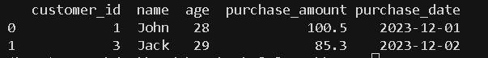

# 数据处理过程

## 一、数据预处理

### 1. 数据清洗

数据清洗是指识别并纠正数据中的错误或不一致之处，以确保数据的准确性和完整性。其目的是解决可能扭曲分析或模型性能的问题。

* **处理缺失值**
* **删除重复项**
* **纠正不一致的格式**

~~~python
import pandas as pd
import time
from sklearn.impute import SimpleImputer

startTime = time.time()
print(f"Start time: {startTime}")
# Creating a manual dataset
data = pd.DataFrame({
    'name': ['John', 'Jane', 'Jack', 'John', None],
    'age': [28, 34, None, 28, 22],
    'purchase_amount': [100.5, None, 85.3, 100.5, 50.0],
    'date_of_purchase': ['2023/12/01', '2023/12/02', '2023/12/01', '2023/12/01', '2023/12/03']
	})

# Handling missing values using mean imputation for 'age' and 'purchase_amount'
imputer = SimpleImputer(strategy='mean')
data[['age', 'purchase_amount']] = imputer.fit_transform(data[['age', 'purchase_amount']])

# Removing duplicate rows
data = data.drop_duplicates()

# Correcting inconsistent date formats
data['date_of_purchase'] = pd.to_datetime(data['date_of_purchase'], errors='coerce')

print(data)
endTime = time.time()
print(f"End time: {endTime}")
print(f"Time taken: {endTime - startTime} seconds")
~~~

### 2. 数据集成

数据集成是指将来自多个数据源的数据合并，以创建统一的数据集。当数据来自不同的源系统时，数据集成通常是必要的。

* **模式匹配**
* **数据去重**

~~~python
# Creating two manual datasets
data1 = pd.DataFrame({
    'customer_id': [1, 2, 3],
    'name': ['John', 'Jane', 'Jack'],
    'age': [28, 34, 29]
})

data2 = pd.DataFrame({
    'customer_id': [1, 3, 4],
    'purchase_amount': [100.5, 85.3, 45.0],
    'purchase_date': ['2023-12-01', '2023-12-02', '2023-12-03']
})

# Merging datasets on a common key 'customer_id'
merged_data = pd.merge(data1, data2, on='customer_id', how='inner')

print(merged_data)
~~~

### 3、数据转换

数据转换将数据转换为适合分析、机器学习或数据挖掘的格式。

* **缩放和归一化**
* **分类变量编码**
* **特征工程和提取**