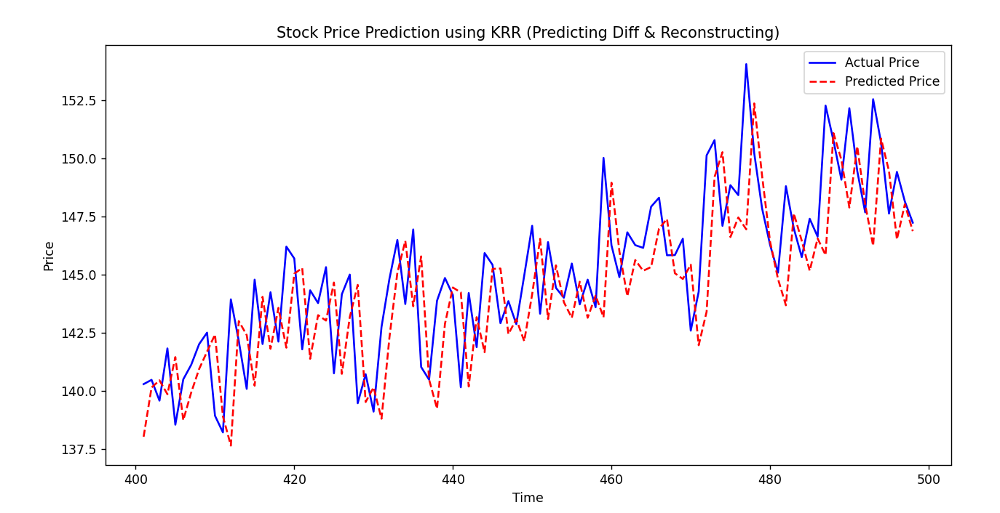

<h1>机器学习算法</h1>

# 一、有监督学习

## 1. 线性回归

代码示例：

~~~python
import numpy as np
import matplotlib.pyplot as plt
from matplotlib.backends.backend_tkagg import FigureCanvasTkAgg
import tkinter as tk
from sklearn.linear_model import LinearRegression
from sklearn.model_selection import train_test_split
from sklearn.metrics import mean_squared_error, r2_score

# 设置中文字体，解决中文显示问题
plt.rcParams['font.sans-serif'] = ['SimHei', 'Microsoft YaHei', 'KaiTi']  # Windows 常用中文字体
plt.rcParams['axes.unicode_minus'] = False  # 解决负号显示为方块的问题

# 设置随机种子确保结果可重现
np.random.seed(42)

# 生成示例数据：房屋面积与价格关系
# 假设真实关系是 y = 3*X + 2 + 噪声
X = np.random.rand(100, 1) * 100  # 100个房屋面积数据，范围0-100平方米
y = 3 * X.flatten() + 2 + np.random.randn(100) * 10  # 房价，带有随机噪声

print(f"数据形状: X{X.shape}, y{y.shape}")
print("前5个样本:")
for i in range(5):
    print(f"房屋面积: {X[i][0]:.1f}平方米, 价格: {y[i]:.1f}万元")

# 划分训练集(80%)和测试集(20%)
X_train, X_test, y_train, y_test = train_test_split(X, y, test_size=0.2, random_state=42)

# 创建统一的大图，3行2列布局，增大高度确保不重叠
fig, axes = plt.subplots(3, 2, figsize=(14, 18))

# 图1: 房屋面积与价格关系
axes[0, 0].scatter(X_train, y_train, color='blue', alpha=0.7, label='训练集')
axes[0, 0].scatter(X_test, y_test, color='red', alpha=0.7, label='测试集')
axes[0, 0].set_xlabel('房屋面积 (平方米)')
axes[0, 0].set_ylabel('价格 (万元)')
axes[0, 0].set_title('1. 房屋面积与价格关系')
axes[0, 0].legend()
axes[0, 0].grid(True, alpha=0.3)

# 图2: 目标变量分布
axes[0, 1].hist(y_train, alpha=0.7, label='训练集', bins=15)
axes[0, 1].hist(y_test, alpha=0.7, label='测试集', bins=15)
axes[0, 1].set_xlabel('价格 (万元)')
axes[0, 1].set_ylabel('频数')
axes[0, 1].set_title('2. 目标变量分布')
axes[0, 1].legend()

# 创建线性回归模型
model = LinearRegression()

# 在训练集上训练模型
model.fit(X_train, y_train)

# 获取模型参数
slope = model.coef_[0]  # 系数(斜率)
intercept = model.intercept_  # 截距

print("=== 模型训练结果 ===")
print(f"回归方程: y = {slope:.4f} * X + {intercept:.4f}")
print(f"学习到的斜率(系数): {slope:.4f}")
print(f"学习到的截距: {intercept:.4f}")
print(f"真实关系: y = 3 * X + 2 + 噪声")

# 对比真实关系与学习到的关系
x_range = np.linspace(0, 100, 100)
y_learned = slope * x_range + intercept
y_true = 3 * x_range + 2

# 图3: 线性回归拟合结果
axes[1, 0].scatter(X_train, y_train, color='blue', alpha=0.7, label='训练数据')
axes[1, 0].plot(x_range, y_true, 'g--', label='真实关系: y=3x+2', linewidth=2)
axes[1, 0].plot(x_range, y_learned, 'r-', label=f'学习到的关系: y={slope:.2f}x+{intercept:.2f}', linewidth=2)
axes[1, 0].set_xlabel('房屋面积 (平方米)')
axes[1, 0].set_ylabel('价格 (万元)')
axes[1, 0].set_title('3. 线性回归拟合结果')
axes[1, 0].legend()
axes[1, 0].grid(True, alpha=0.3)

# 在测试集上进行预测
y_pred = model.predict(X_test)

# 计算评估指标
mse = mean_squared_error(y_test, y_pred)
rmse = np.sqrt(mse)
r2 = r2_score(y_test, y_pred)

print("=== 模型测试集性能 ===")
print(f"均方误差 (MSE): {mse:.2f}")
print(f"均方根误差 (RMSE): {rmse:.2f}")
print(f"决定系数 (R²): {r2:.4f}")

# 图4: 预测值vs实际值
axes[1, 1].scatter(X_test, y_test, color='blue', alpha=0.7, label='真实值')
axes[1, 1].scatter(X_test, y_pred, color='red', alpha=0.7, label='预测值')
axes[1, 1].plot([min(y_test), max(y_test)], [min(y_test), max(y_test)], 'k--', label='完美预测')
axes[1, 1].set_xlabel('实际价格 (万元)')
axes[1, 1].set_ylabel('预测价格 (万元)')
axes[1, 1].set_title('4. 预测值 vs 实际值')
axes[1, 1].legend()
axes[1, 1].grid(True, alpha=0.3)

# 图5: 残差分析
residuals = y_test - y_pred
axes[2, 0].scatter(y_pred, residuals, alpha=0.7)
axes[2, 0].axhline(y=0, color='red', linestyle='--')
axes[2, 0].set_xlabel('预测值')
axes[2, 0].set_ylabel('残差 (实际值-预测值)')
axes[2, 0].set_title('5. 残差分析')
axes[2, 0].grid(True, alpha=0.3)

# 输出部分预测结果对比
print("\n=== 预测结果对比 (前10个样本) ===")
print("面积(㎡)\t实际价格(万)\t预测价格(万)\t误差")
print("-" * 55)
for i in range(min(10, len(X_test))):
    error = y_pred[i] - y_test[i]
    print(f"{X_test[i][0]:.1f}\t{y_test[i]:.2f}\t\t{y_pred[i]:.2f}\t\t{error:+.2f}")

# 使用模型进行新预测
new_areas = np.array([[45], [78], [120], [150]])  # 新房屋面积
predictions = model.predict(new_areas)

print("=== 新房屋价格预测 ===")
for area, price in zip(new_areas, predictions):
    print(f"房屋面积 {area[0]:.0f} 平方米 -> 预测价格: {price:.2f} 万元")

# 图6: 新房屋价格预测
axes[2, 1].scatter(X, y, alpha=0.5, label='历史数据')
axes[2, 1].scatter(new_areas, predictions, color='red', s=100, marker='*', label='新预测')
axes[2, 1].plot(x_range, slope * x_range + intercept, 'r-', label='回归直线')
axes[2, 1].set_xlabel('房屋面积 (平方米)')
axes[2, 1].set_ylabel('价格 (万元)')
axes[2, 1].set_title('6. 新房屋价格预测')
axes[2, 1].legend()
axes[2, 1].grid(True, alpha=0.3)

# 统一显示所有图表
fig.suptitle('线性回归完整分析', fontsize=16, fontweight='bold', y=0.995)
plt.subplots_adjust(left=0.08, right=0.95, top=0.96, bottom=0.05, hspace=0.35, wspace=0.25)

# 创建带滚动条的 tkinter 窗口
root = tk.Tk()
root.title('线性回归完整分析')
root.geometry('1200x700')  # 窗口初始大小

# 创建主框架
main_frame = tk.Frame(root)
main_frame.pack(fill=tk.BOTH, expand=True)

# 创建画布和滚动条
canvas = tk.Canvas(main_frame)
scrollbar_y = tk.Scrollbar(main_frame, orient=tk.VERTICAL, command=canvas.yview)
scrollbar_x = tk.Scrollbar(root, orient=tk.HORIZONTAL, command=canvas.xview)

# 配置画布滚动
canvas.configure(yscrollcommand=scrollbar_y.set, xscrollcommand=scrollbar_x.set)

# 布局滚动条和画布
scrollbar_y.pack(side=tk.RIGHT, fill=tk.Y)
scrollbar_x.pack(side=tk.BOTTOM, fill=tk.X)
canvas.pack(side=tk.LEFT, fill=tk.BOTH, expand=True)

# 创建内部框架用于放置图表
inner_frame = tk.Frame(canvas)
canvas.create_window((0, 0), window=inner_frame, anchor='nw')

# 将 matplotlib 图表嵌入到 tkinter 窗口
figure_canvas = FigureCanvasTkAgg(fig, master=inner_frame)
figure_canvas.draw()
figure_canvas.get_tk_widget().pack(fill=tk.BOTH, expand=True)

# 更新滚动区域
def update_scroll_region(event=None):
    canvas.configure(scrollregion=canvas.bbox('all'))

inner_frame.bind('<Configure>', update_scroll_region)

# 添加鼠标滚轮支持
def on_mousewheel(event):
    canvas.yview_scroll(int(-1 * (event.delta / 120)), 'units')

canvas.bind_all('<MouseWheel>', on_mousewheel)

# 运行 tkinter 主循环
root.mainloop()
~~~

## 2. LDA & QDA

线性判别分析（LDA）和二次判别分析（QDA）是两种基于概率模型的高效分类算法

线性判别分析（LDA）和二次判别分析（QDA）是两种基于概率模型的高效分类算法。下面我将为你详细解析它们的作用、使用场景，并提供一个具体的代码示例。

### 算法概述与核心作用

LDA和QDA都是经典的统计学习方法，基于数据服从高斯分布的假设，通过贝叶斯定理构建分类决策边界。

**核心作用**：

- **分类任务**：将样本划分到不同的预定义类别中
- **维度压缩**：LDA可执行有监督的降维，找到最大化类间分离的方向
- **概率输出**：提供样本属于各类别的后验概率估计

### 主要特性

| 特性           | 线性判别分析 (LDA)         | 二次判别分析 (QDA)         |
| -------------- | -------------------------- | -------------------------- |
| **决策边界**   | 线性                       | 二次曲线                   |
| **协方差假设** | 所有类别共享相同协方差矩阵 | 每个类别有自己的协方差矩阵 |
| **参数数量**   | 较少（更简单）             | 较多（更灵活）             |
| **适用场景**   | 数据近似线性可分           | 数据需要非线性决策边界     |
| **过拟合风险** | 较低                       | 较高（尤其小样本时）       |

### 示例代码

~~~python
import numpy as np
import matplotlib.pyplot as plt
from sklearn.discriminant_analysis import LinearDiscriminantAnalysis, QuadraticDiscriminantAnalysis

# 生成合成数据
def generate_data(cov_class_1, cov_class_2, n_samples=300):
    rng = np.random.RandomState(0)
    X1 = rng.randn(n_samples, 2) @ cov_class_1
    X2 = rng.randn(n_samples, 2) @ cov_class_2 + np.array([1, 1])
    X = np.concatenate([X1, X2])
    y = np.concatenate([np.zeros(n_samples), np.ones(n_samples)])
    return X, y

def plot_decision_boundary(ax, clf, X, y, title):
    # 创建网格
    x_min, x_max = X[:, 0].min() - 1, X[:, 0].max() + 1
    y_min, y_max = X[:, 1].min() - 1, X[:, 1].max() + 1
    xx, yy = np.meshgrid(np.arange(x_min, x_max, 0.02),
                         np.arange(y_min, y_max, 0.02))
    
    # 预测网格点的类别
    Z = clf.predict(np.c_[xx.ravel(), yy.ravel()])
    Z = Z.reshape(xx.shape)
    
    # 绘制轮廓和数据点
    ax.contourf(xx, yy, Z, alpha=0.3, cmap='coolwarm')
    ax.scatter(X[:, 0], X[:, 1], c=y, cmap='coolwarm', edgecolors='k', s=25)
    ax.set_title(title)

#  scenario 1: 相同协方差矩阵（LDA理想场景）
covariance = np.array([[0.0, -0.23], [0.83, 0.23]])
X1, y1 = generate_data(covariance, covariance)

#  scenario 2: 不同协方差矩阵（QDA理想场景）
cov_class_1 = np.array([[0.0, -1.0], [2.5, 0.7]]) * 2.0
cov_class_2 = cov_class_1.T  # 转置矩阵，结构不同
X2, y2 = generate_data(cov_class_1, cov_class_2)

# 训练并比较模型
lda = LinearDiscriminantAnalysis()
qda = QuadraticDiscriminantAnalysis()

fig, axes = plt.subplots(2, 2, figsize=(10, 8))

for i, (X, y) in enumerate([(X1, y1), (X2, y2)]):
    lda.fit(X, y)
    qda.fit(X, y)
    
    plot_decision_boundary(axes[i, 0], lda, X, y, f"Dataset {i+1} : LDA")
    plot_decision_boundary(axes[i, 1], qda, X, y, f"Dataset {i+1} : QDA")

plt.tight_layout()
plt.show()
~~~

## 3. KRR

### 示例代码

使用窗口均值预测涨跌，而不是直接预测实际价格。

~~~python
import numpy as np
import pandas as pd
from sklearn.kernel_ridge import KernelRidge
from sklearn.preprocessing import StandardScaler
from sklearn.model_selection import train_test_split
import matplotlib.pyplot as plt

# 1. 生成模拟的股票历史价格数据（示例中使用虚拟数据）
# 假设有500个交易日的收盘价，并生成一些简单的技术指标作为特征
np.random.seed(42)
dates = pd.date_range(start='2020-01-01', periods=500, freq='D')
# 模拟收盘价：假设有一个基础趋势和一些随机波动
base_trend = np.linspace(100, 150, 500)
random_noise = np.random.normal(0, 2, 500)
prices = base_trend + random_noise

# 创建特征DataFrame：这里简单使用滞后价格和移动平均线作为示例特征
data = pd.DataFrame({'Close': prices})
data['Close_Lag1'] = data['Close'].shift(1)
# 5日均线
data['MA_5'] = data['Close'].rolling(window=5).mean()
# 10日均线
data['MA_10'] = data['Close'].rolling(window=10).mean()
data = data.dropna() # 删除因计算指标产生的缺失值

# 2. 修改目标变量：预测价格变化量（Diff），而不是绝对价格
# 这样可以去除趋势（Detrending），使数据平稳，适合RBF核
data['Target_Diff'] = data['Close'].shift(-1) - data['Close']
data = data.dropna()

X = data[['Close_Lag1', 'MA_5', 'MA_10']]
y = data['Target_Diff']  # 现在的目标是预测涨跌额

# 3. 划分训练集和测试集（按时间顺序划分）
# 注意：我们需要保留划分前的原始价格数据，用于后续还原预测值
train_size = int(len(data) * 0.8)
X_train_raw, X_test_raw = X.iloc[:train_size], X.iloc[train_size:]
y_train, y_test = y.iloc[:train_size], y.iloc[train_size:]

# 4. 数据预处理 - 标准化特征
# 关键修复：只在训练集上fit，避免数据泄露
scaler = StandardScaler()
X_train = scaler.fit_transform(X_train_raw)
X_test = scaler.transform(X_test_raw)

# 5. 创建并训练KRR模型
# 使用RBF（高斯）核。由于现在预测的是平稳的Diff，RBF效果会好很多
krr_model = KernelRidge(kernel='rbf', alpha=0.1, gamma=0.1)
krr_model.fit(X_train, y_train)

# 6. 进行预测
y_pred_train_diff = krr_model.predict(X_train)
y_pred_test_diff = krr_model.predict(X_test)

# 7. 还原预测结果（从 Diff 还原回绝对价格）
# 预测的明天价格 = 今天的价格 + 预测的涨跌额
# 对应关系：X_test的每一行对应当天的特征，我们要预测明天的价格
# 所以基准价格是 X_test 对应的当天的 'Close' 价格
# 注意：X 中没有包含当天的 'Close'，但我们可以从原始 data 中获取
test_indices = X_test_raw.index
current_prices_test = data.loc[test_indices, 'Close'].values
current_prices_train = data.loc[X_train_raw.index, 'Close'].values

y_pred_test_price = current_prices_test + y_pred_test_diff
y_pred_train_price = current_prices_train + y_pred_train_diff

# 真实的目标价格（用于对比）
y_test_price = current_prices_test + y_test.values
y_train_price = current_prices_train + y_train.values

# 8. 评估与可视化
train_rmse = np.sqrt(np.mean((y_train_price - y_pred_train_price)**2))
test_rmse = np.sqrt(np.mean((y_test_price - y_pred_test_price)**2))
print(f"Train RMSE: {train_rmse:.2f}")
print(f"Test RMSE: {test_rmse:.2f}")

plt.figure(figsize=(12, 6))
plt.plot(data.loc[test_indices].index, y_test_price, label='Actual Price', color='blue')
plt.plot(data.loc[test_indices].index, y_pred_test_price, label='Predicted Price', color='red', linestyle='--')
plt.title('Stock Price Prediction using KRR (Predicting Diff & Reconstructing)')
plt.xlabel('Time')
plt.ylabel('Price')
plt.legend()
plt.show()
~~~

## 4. SVM

~~~python
# 导入必要的库
import numpy as np
import matplotlib.pyplot as plt
from sklearn import datasets
from sklearn.model_selection import train_test_split
from sklearn.preprocessing import StandardScaler
from sklearn.svm import SVC
from sklearn.metrics import accuracy_score, classification_report, confusion_matrix
from sklearn.model_selection import GridSearchCV

# 加载鸢尾花数据集
iris = datasets.load_iris()
X = iris.data  # 特征矩阵
y = iris.target  # 目标标签

# 为了方便可视化，我们只使用前两个特征（花萼长度和花萼宽度）
# 在实际项目中，通常会使用所有特征，或者使用降维技术（如PCA）降到2-3维进行可视化
X = X[:, :2]

# 划分数据集：70%用于训练，30%用于测试
# random_state=42 保证每次运行划分结果一致，便于复现
X_train, X_test, y_train, y_test = train_test_split(X, y, test_size=0.3, random_state=42)

# 标准化特征（SVM对数据尺度敏感，通常需要进行标准化）
# SVM 试图最大化决策边界的间隔，如果特征尺度差异大，大尺度的特征会主导距离计算
scaler = StandardScaler()
# fit_transform: 在训练集上计算均值和方差，并应用标准化
X_train_scaled = scaler.fit_transform(X_train)
# transform: 使用训练集的均值和方差对测试集进行标准化（防止数据泄露）
X_test_scaled = scaler.transform(X_test)

# 创建SVM分类器，使用线性核函数
# C是正则化参数，控制错误分类的惩罚力度
# C值较小 -> 容忍更多的误分类（软间隔），边界更平滑，泛化能力可能更强
# C值较大 -> 尽量减少误分类（硬间隔），边界更复杂，可能导致过拟合
svm_classifier = SVC(kernel='linear', C=1.0, random_state=42)

# 使用标准化后的训练数据训练模型
svm_classifier.fit(X_train_scaled, y_train)

# 使用训练好的模型对标准化后的测试集进行预测
y_pred = svm_classifier.predict(X_test_scaled)

# 计算并打印准确率
accuracy = accuracy_score(y_test, y_pred)
print(f"模型准确率: {accuracy:.2f}")

# 打印详细的分类报告
print("\n分类报告:")
print(classification_report(y_test, y_pred))

# 打印混淆矩阵
print("混淆矩阵:")
print(confusion_matrix(y_test, y_pred))

# 定义要搜索的参数网格
# SVM的效果高度依赖于参数的选择
param_grid = {
    'C': [0.1, 1, 10, 100],  # 正则化参数候选列表
    'kernel': ['linear', 'rbf'],  # 核函数：线性核 vs 径向基函数核（高斯核）
    'gamma': ['scale', 'auto', 0.1, 1]  # 核系数：影响RBF核的分布范围
    # gamma越大 -> 高斯分布越窄 -> 模型只关注支持向量附近的样本 -> 易过拟合
    # gamma越小 -> 高斯分布越宽 -> 模型受更多样本影响 -> 边界更平滑
}

# 创建GridSearchCV对象
# GridSearchCV 会遍历 param_grid 中的所有组合
# cv=5 表示使用 5 折交叉验证：将训练集分成 5 份，轮流用 4 份训练，1 份验证
grid_search = GridSearchCV(SVC(random_state=42), param_grid, cv=5, verbose=1)

# 在训练数据上执行网格搜索（自动寻找最佳参数）
grid_search.fit(X_train_scaled, y_train)

# 输出最佳参数组合
print("找到的最佳参数: ", grid_search.best_params_)

# 使用最佳参数的模型进行预测
best_model = grid_search.best_estimator_
y_pred_best = best_model.predict(X_test_scaled)
best_accuracy = accuracy_score(y_test, y_pred_best)
print(f"调优后模型准确率: {best_accuracy:.2f}")

def plot_decision_boundary(model, X, y, title):
    """
    绘制SVM的决策边界和支持向量
    """
    # 创建网格点，用于绘制背景的决策区域
    h = 0.02  # 网格步长
    # 确定网格的边界范围，稍微留出一点边距
    x_min, x_max = X[:, 0].min() - 1, X[:, 0].max() + 1
    y_min, y_max = X[:, 1].min() - 1, X[:, 1].max() + 1
    # np.meshgrid 生成二维网格坐标矩阵
    xx, yy = np.meshgrid(np.arange(x_min, x_max, h),
                         np.arange(y_min, y_max, h))
    
    # 预测整个网格中每个点的类别
    # np.c_ 将 xx 和 yy 拉平后按列拼接，构造出测试点矩阵
    Z = model.predict(np.c_[xx.ravel(), yy.ravel()])
    # 将预测结果重塑回网格形状，以便绘制等高线
    Z = Z.reshape(xx.shape)
    
    # 绘制填充等高线图（决策区域）
    plt.figure(figsize=(10, 8))
    plt.contourf(xx, yy, Z, alpha=0.8, cmap=plt.cm.coolwarm)
    
    # 绘制原始数据散点图
    scatter = plt.scatter(X[:, 0], X[:, 1], c=y, edgecolors='k', marker='o', cmap=plt.cm.coolwarm)
    
    # 标记支持向量（决定决策边界的关键样本点）
    sv = model.support_vectors_
    # 用空心圆圈圈出支持向量
    plt.scatter(sv[:, 0], sv[:, 1], facecolors='none', edgecolors='k', s=100, linewidths=1, label='Support Vectors')
    
    plt.colorbar(scatter)
    plt.xlabel('Sepal length (standardized)')
    plt.ylabel('Sepal width (standardized)')
    plt.title(title)
    plt.legend()
    plt.show()

# 绘制调优后的模型决策边界
plot_decision_boundary(best_model, X_train_scaled, y_train, "SVM Decision Boundary (Optimized)")
~~~

